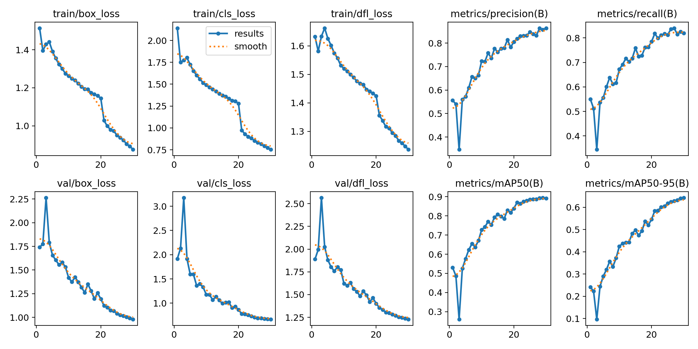
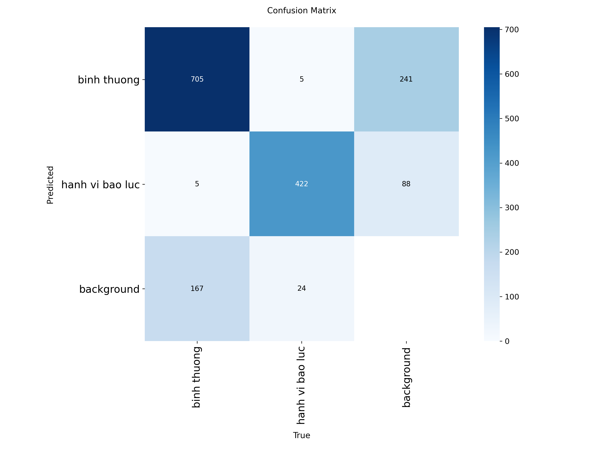

# Violent Behavior Detection — YOLOv11


Phát hiện **Hành vi bạo lực thời gian thực** sử dụng mô hình **YOLO11n**, huấn luyện trên Kaggle GPU T4 x2 với dataset public từ Roboflow.

---

## Demo

<!-- Thêm ảnh predict mẫu sau khi có kết quả -->


---

## Kết quả trực quan

| Training Curves | Confusion Matrix |
|:---:|:---:|
|  |   |


---

## Cấu trúc dự án

```
Violent Behavior Detection-yolo11n/
├── app.py
├── notebooks/
│   └── bien-bao-giao-thong-viet-nam.ipynb   # Pipeline đầy đủ: EDA → train → eval → inference
├── configs/
│   └── data.yaml                          # Cấu hình dữ liệu
├── scripts/
│   ├── export_onnx.py                        # Export sang ONNX
│   └── inference_video.py                    # Inference trên video
├── results/                                  # Confusion matrix, PR curve, training curves
├── weights/                                  # best.pt (Git LFS)
├── requirements.txt
└── README.md
```

---

## Dataset

| | |
|---|---|
| **Nguồn** | Roboflow → Kaggle |
| **Link** | [violent dataset](https://www.kaggle.com/datasets/namvipcf2000/violence-dataset)(https://www.kaggle.com/datasets/namvipcf2000/violence-dataset-v2) |
| **Số class** | 2 lớp  |
| **Format** | YOLOv8/v11 (YOLO txt labels) |


---

## Kaggle Notebook

Toàn bộ pipeline 9 bước chạy trên Kaggle GPU T4 x2:

| Bước | Nội dung |
|------|---------|
| 1 | Kiểm tra môi trường & GPU |
| 2 | Cài đặt thư viện (Ultralytics) |
| 3 | Gộp bộ dữ liệu và tạo cấu hình data.yaml |
| 4 | Khám phá dataset (EDA) |
| 5 | Huấn luyện YOLOv11n |
| 6 | Theo dõi training curves |
| 7 | Đánh giá trên tập test |
| 8 | Đánh giá tốc độ mô hình |
| 9 | Inference ảnh & video, export TensorRT |

[Xem notebook trên Kaggle](https://www.kaggle.com/code/namvipcf2000/h-nh-vi-b-o-l-c) 

---

## Chạy Demo local

```bash
# Clone repo
git clone https://github.com/Namvipcf/Violent-Behavior-Detection-Yolo11n.git
cd Violent-Behavior-Detection-Yolo11n

# Cài thư viện
pip install -r requirements.txt

# Chạy Gradio app
streamlit run app.py
```

Mở trình duyệt tại `http://localhost:7860` — giao diện hỗ trợ:
- **Tab Ảnh** — upload nhiều ảnh cùng lúc, xem bounding box + bảng tổng hợp
- **Tab Video** — upload video, hiển thị và xuất video đã gắn nhãn
- **Slider confidence** — điều chỉnh ngưỡng phát hiện (mặc định 0.5)

> `best.pt` phải nằm cùng thư mục với `app.py`

---

## Tham số huấn luyện

| Tham số | Giá trị |
|---------|---------|
| Model | `yolo11n.pt` |
| Epochs | 30 |
| Image size | 640 × 640 |
| Batch size | 64 |
| Device | GPU T4 × 2 |
| Patience | 10 (early stopping) |
| Augmentation | HSV, translate, scale, mosaic, flip |

---

## Cài đặt & chạy local

```bash
# Clone repo
git clone https://github.com/Namvipcf/Violent-Behavior-Detection-Yolo11n.git
cd Violent-Behavior-Detection-Yolo11n

# Cài thư viện
pip install -r requirements.txt
```

**Inference ảnh:**
```python
from ultralytics import YOLO

model = YOLO("weights/best.pt")
results = model.predict("anh_bao_luc.jpg", conf=0.5)
results[0].show()
```

**Inference video:**
```bash
python scripts/inference_video.py --source video.mp4 --weights weights/best.pt
```

---


## Môi trường huấn luyện

| | |
|---|---|
| Platform | Kaggle Notebooks |
| GPU | NVIDIA Tesla T4 × 2 |
| VRAM | 16 GB × 2 |
| Framework | Ultralytics YOLO |
| Export | ONNX, TensorRT (FP16) |

---

## License

MIT License — xem [LICENSE](LICENSE)

---

## Tác giả

**Nguyễn Văn Bắc**
- GitHub: (https://github.com/Namvipcf)
- Kaggle: (https://www.kaggle.com/Namvipcf2000)
